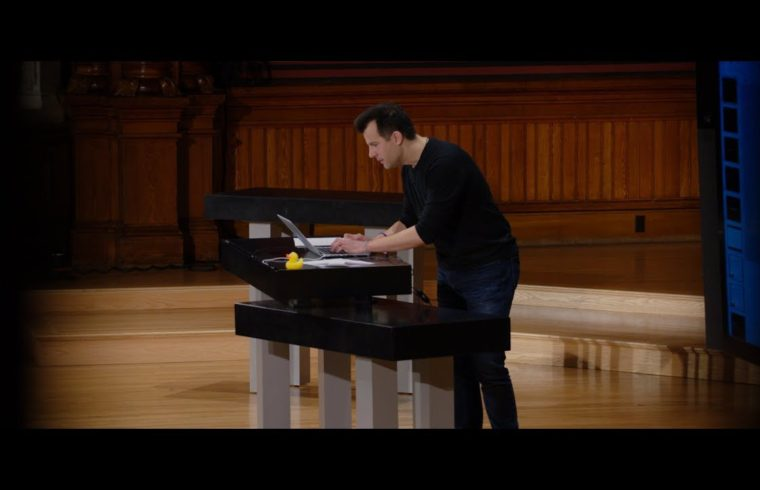

# Course50

Having taken a certain well-known online *"Introduction to Computer Science course,* this repository serves to showcase what I learnt as well as the solutions I came up with.

# Table of Contents

As the course covers a broad range of topics, the solutions also serve as interesting foundational templates to experiment with, and improve upon, as I continue to learn more.

I've grouped the Psets by the predominant technology used for clarity.

## Table of Contents

* [Programming with C](#c-programming)
* [Simple Website](#website)
* [Programming with Python](#python)
* [Programming with Javascript](#javascript)

## Programming with C

I'm using the [Microsoft C/C++ extension](https://marketplace.visualstudio.com/items?itemName=ms-vscode.cpptools) for Visual Studio Code and the [Code Runner](https://marketplace.visualstudio.com/items?itemName=formulahendry.code-runner) extension where possible to run these programs locally on OSX.

For some solutions, I've taken advantage of the course's provided helper library to focus on solving the problems rather than getting bogged down in C's intricacies. I may rewrite these solutions without the helper library at a later date if I'll choose/need to work with C, or simply as a challenge.

In order to compile solutions locally (OSX) where the helper library was used*:

1. Ensure to have Xcode installed
2. Download the library [here](https://github.com/cs50/libcs50/releases)
3. Extract the folder and move into that directory
4. Execute the following commands:
   1. `gcc -c -ggdb -std=c99 cs50.c -o cs50.o`
   2. `ar rcs libcs50.a cs50.o`
   3. `rm -f cs50.o`
   4. `chmod 0644 cs50.h libcs50.a`
   5. `sudo mkdir -p /usr/local/include`
   6. `sudo mv -f cs50.h /usr/local/include`
   7. `sudo mkdir -p /usr/local/lib`
   8. `sudo mv -f libcs50.a /usr/local/lib`
   9. `cd ..`
   10. `rm -rf library50-c-5`
5. Make sure you have the appropriate header file atop your program
6. From your working directory, compile with: `gcc -g filename.c -o filename -lcs50 -lm`
7. Execute the program like so: `./filename`

*Steps taken from [here](https://cs50.stackexchange.com/a/2998/23961).

## Pset 1

### Specs:

1. *half_pyramid.c*
   + Get user input between a specified range (0 - 23)
   + Print out a half pyramid (as seen in Super Mario) consisting of spaces and hashes

2. *money.c*
   + Get user input in dollars
   + Output the minimum number of coins that can be given in change (from 25, 10, 5, 1 cent coins)

### Learning goals:

* [x] Getting user input
* [x] Converting a string to an int
* [x] Nested loops
* [x] Printing output
* [x] Arithmetic operations
* [x] Working with ints and floats

## Pset 2

### Specs:

1. *emperor.c*
   + Take a message and key from user and apply the Caesar cipher.

2. *encryption2.c*
   + Take a message and keyword from user and apply Vigenère’s cipher.

### Learning goals:

* [x] Learn about encryption
* [x] Creating and calling helper functions
* [x] Use #define to delcare macro constants
* [x] Working with ASCII and relating those values to alphanumeric characters
* [x] String methods
* [x] Taking command line arguments and performing basic validation

## Pset 3

### Specs:

1. *mystery.c*
   + Discover who commited the crime by reading and manipulating .bmp files

2. *newSize.c*
   + Resize an image passed in by user with their scale factor of choice

3. *getBack.c*
   + Recover deleted JPEGs from a forensic snapshot of a camera's memory card

### Learning goals:

* [x] Reading to and writing from files and using file pointers
* [x] Working with .bmp files
* [x] Being mindful of memory
* [x] Manipulating images programmatically

## Pset 4

### Specs:

1. *speller.c*
   + Implement a fast spell checker, ignoring memory cost to focus on speed.

### Learning goals:

* [x] Taking time/memory into account when programming
* [x] Differentiating "asymptotic time" and "real time"
* [x] Compiling more complex programs (with config file)
* [x] Loading from disk to memory - using hash tables
* [x] More pointers
* [x] Memory allocation and freeing up memory
* [x] Using structs
* [x] Benchmark tests
* [x] String comparisons
* [x] Hash functions

# Simple website
# Programming with Python
# Programming with JavaScript

*Course unnamed in order to respect wishes not to litter the internet with easily searchable solutions... but here's a sneaky hint:

